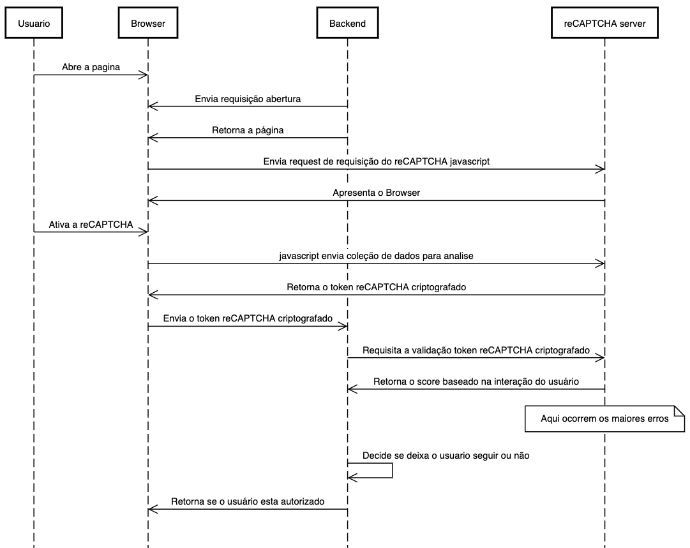

reCAPTCHA
O reCAPTCHA é um serviço de CAPTCHA sigla, em inglês, para “Completely Automated Public Turing Test to Tell Computers and Humans Apart”, que em tradução simplificada seria “Teste de Turing público e automatizado para separar computadores de humanos”, ou seja um processo para testar se é uma pessoa ou máquina. 

O objetivo principal é conseguir separar trafego para sites e aplicativos, bloqueando que Robôs utilizem seus sites e evitando assim sobrecarga no seu servidor. 

Atualmente o reCAPTCHA possui 2 implementações a V2 ( invisível e checkbox ) e a V3 ( totalmente transparente, utilizando um score ).

Sendo bem simplista a diferença entre a V2 e a V3 é que esta ultima não apresente desafio algum para o usuário final, havendo apenas bloquei ou não para o usuário final, segundo o google a nova versão garante mais autonomia para os gestores de site. 

[Clique aqui](https://youtu.be/tbvxFW4UJdU)

Independente da versão utilizada ( V2 ou V3 ) o processo de implementação do reCAPTCHA é feito em 2 blocos, um processo que roda no lado do cliente e um segundo que roda no lado do servidor, vide esquema abaixo:

Um dos erros mais comuns na implementação e não testar o segunda etapa, onde o seu servidor vai até o google e verifica se o token passado é válido. Caso essa etapa não seja feita  a implementação do reCAPTCHA está totalmente ineficaz, comprometendo assim o seu servidor.

Uma forma muito simple é utilizando uma ferramenta de captura de requisição como o Burp Suite, interceptar a requisição e alterar o valor do campo g-recaptcha-response e verificar se o servidor ira retornar sucesso ou falha na requisição, caso o servidor aceite requisição com o valor do g-recaptcha-response alterado, significa que sua implementação esta insegura e o reCAPTCHA foi implementado de forma insegura e incorreta. 
 
Outra forma de testar é utilizando o chrome e copiar a requisição feita via curl e reenviar/alterar via linha de comando, como o reCAPTCHA não aceita reutilização token, o reenvio via curl tem que retornar erro no retorno.

O reCAPTCHA é uma solução muito útil e eficaz para mitigação abuso no consumo do servidor, mas para que isso ocorra a implementação deve ser feita de forma correta, caso contrário será somente uma feature inútil ao seu site. 
